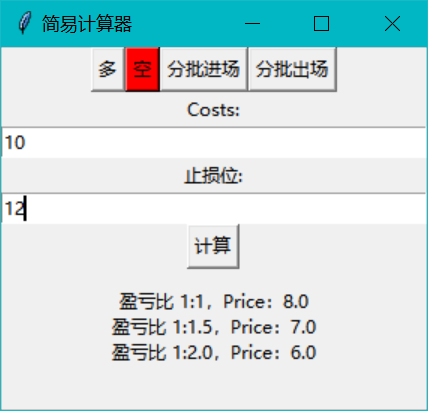
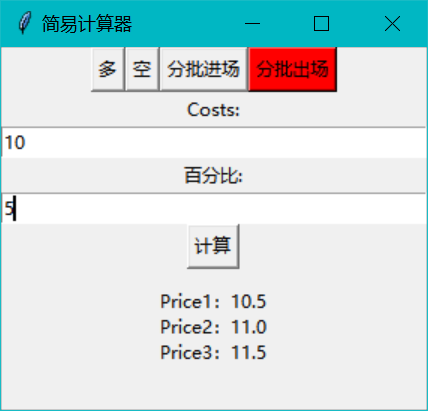

# web3_calculator

## 简介

用于计算止盈止损以及进出场点位


## 使用方法

```
python

# 先安装
pip install web3_calculator==0.0.7

# 再使用
from web3_calculator import web3_calculator

wc = web3_calculator()

```


## 多单


## 空单



## 分批进场


## 分批出场


